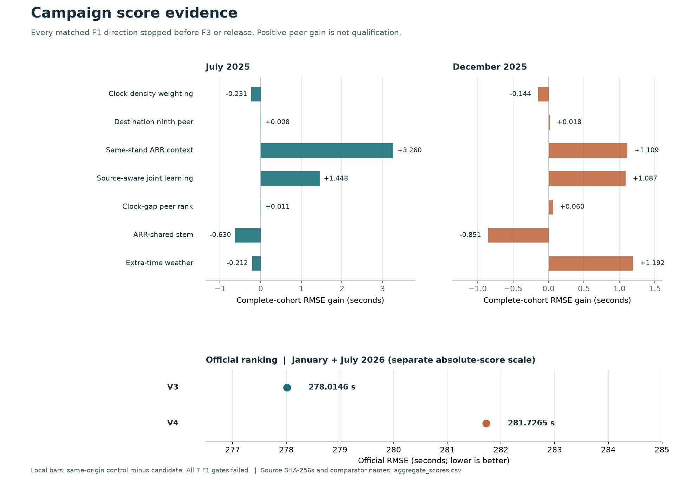

# Campaign score evidence (frozen September 24 snapshot)

The local bars show **control RMSE minus candidate RMSE** on the *same complete 2025 F1 cohort*. Positive values mean the candidate won that specific paired comparison. Each row has its own same-origin comparator; the bar heights are **not** an absolute model-quality ranking. Every plotted local arm failed its predeclared F1 advancement gate and stopped before F3, full-year fit, or upload.

The largest paired gain is same-stand versus airport-wide ARR context (+3.260 seconds in July), but it also had to beat the unchanged base, pass the top-ten-row removal, and survive its June/December checks. It failed the frozen F1 gate; July's gain over base was +0.588 seconds, its paired-day MSE interval crossed zero, and its top-ten-row removal reversed the gain. Source-aware learning improved +1.448 seconds against its equal-capacity rich-only comparator in July but *lost* 4.315 seconds against the unchanged clean base. Extra-time weather gained +1.192 seconds in December while losing 0.212 seconds against routine-only weather in July. None supplies a five-second robust, transported complete-cohort gain.

The lower panel is deliberately on a **different, absolute RMSE scale**: official 2026 V3 = **278.0146** and V4 = **281.7265**, both with `Succeeded` receipts. V3 remains the best of these verified submissions. Neither official point is joined to the local 2025 bars, and historical V3 local 268.662991 is omitted: its July/November fit and evaluation history differs from these earlier-origin F1 arms. A lower local F1 absolute score is not an estimate of official 2026 improvement.

[`aggregate_scores.csv`](aggregate_scores.csv) has fourteen local month rows plus two official receipt rows. Each row includes the exact score receipt and SHA-256; local rows also name their independent audit or postscore report and its SHA-256. The [`build_chart.py`](build_chart.py) script reads **only these aggregate receipts**, verifies pinned hashes and score-to-audit binding, checks original full-cohort row counts and `control - candidate` arithmetic, and regenerates the CSV and PNG. From the PRC workspace root, run `& .\.review-venv\Scripts\python.exe knowledgeable-helicopter-screening\docs\campaign-evidence\build_chart.py`. Rebuilding requires the private local aggregate receipts named in the CSV; the checked chart and CSV travel with this branch.

This plot excludes the July-only backlog result (no matched December), clean F1/F3 controls (no candidate comparison), and input-only scheduled-inbound, route-duration, and other screened directions (no RMSE). Exposed 2025 cohorts and paired-day intervals do not independently validate transfer to 2026; December 2025 is reused transport evidence, not an independent ranking trial. No row represents an unmeasured gain, ranking-month labels, or an unsubmitted official score.
